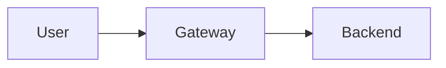

# Contributing to Documentation

This guide explains how to contribute to the FIRST Inference Gateway documentation.

## Documentation Structure

The documentation is built using [MkDocs](https://www.mkdocs.org/) with the [Material theme](https://squidfunk.github.io/mkdocs-material/).

```
docs/
├── index.md                    # Homepage
├── admin-guide/                # Administrator documentation
│   ├── index.md
│   ├── gateway-setup/
│   │   ├── docker.md
│   │   ├── bare-metal.md
│   │   └── configuration.md
│   ├── inference-setup/
│   │   ├── index.md
│   │   ├── direct-api.md
│   │   ├── local-vllm.md
│   │   └── globus-compute.md
│   ├── deployment/
│   │   ├── kubernetes.md
│   │   └── production.md
│   └── monitoring.md
├── user-guide/                 # User documentation
│   ├── index.md
│   ├── authentication.md
│   ├── requests.md
│   ├── batch.md
│   └── examples.md
└── reference/                  # Reference materials
    ├── citation.md
    ├── api.md
    └── config.md
```

## Local Development

### Install Dependencies

```bash
uv sync
```

### Build Documentation

```bash
uv run -- mkdocs build
```

This creates the `site/` directory with static HTML files.

### Serve Locally

```bash
mkdocs serve
```

Then visit: http://127.0.0.1:8000

The site will automatically reload when you save changes.

## Writing Documentation

### Markdown Files

All documentation is written in Markdown with support for:

- Standard Markdown syntax
- [Material for MkDocs extensions](https://squidfunk.github.io/mkdocs-material/reference/)
- Code syntax highlighting
- Admonitions (notes, warnings, tips)
- Tables
- Mermaid diagrams

### Admonitions

```markdown
!!! note "Optional Title"
    This is a note

!!! warning
    This is a warning

!!! tip
    This is a tip

!!! danger
    This is dangerous!
```

### Code Blocks

````markdown
```python
def hello():
    print("Hello, World!")
```

```bash
mkdocs serve
```
````

### Mermaid Diagrams

````markdown

````

### Internal Links

```markdown
[Link text](path/to/file.md)
[Link to section](path/to/file.md#section-name)
```

## Navigation

Navigation is configured in `mkdocs.yml`:

```yaml
nav:
  - Home: index.md
  - Administrator Guide:
      - Overview: admin-guide/index.md
      - Gateway Installation:
          - Docker: admin-guide/gateway-setup/docker.md
```

## Deployment

### Automatic Deployment

Documentation automatically deploys to GitHub Pages when you push to `main`:

1. Make your changes to files in `docs/`
2. Commit and push:
   ```bash
   git add docs/
   git commit -m "docs: update documentation"
   git push origin main
   ```
3. GitHub Actions builds and deploys automatically
4. View at: https://argonne-lcf.github.io/FIRST/

### Manual Deployment

You can also manually trigger deployment:

1. Go to Actions tab on GitHub
2. Select "Deploy Documentation" workflow
3. Click "Run workflow"

## Style Guide

### Headings

- Use sentence case for headings
- One H1 (`#`) per page (the page title)
- Use hierarchical heading levels (don't skip levels)

### Code Examples

- Always include language identifier for syntax highlighting
- Add comments to explain complex code
- Test code examples before committing

### File Names

- Use lowercase with hyphens: `my-file.md`
- Be descriptive: `docker-deployment.md` not `docker.md`

### Writing Style

- Use clear, concise language
- Write in second person ("you") for instructions
- Use active voice
- Include examples wherever possible
- Add context before diving into details

### Code Style

- We use `ruff` to format our codebase
- Run `ruff check` in the project root to conform your code's formatting

## Contributing Process

1. Fork the repository
2. Create a branch: `git checkout -b docs/my-improvement`
3. Make your changes
4. Test locally: `mkdocs serve`
5. Commit with clear message: `git commit -m "docs: improve docker guide"`
6. Push and create a Pull Request

## Questions?

- Open an issue on GitHub
- Check existing documentation
- Review MkDocs Material documentation

## Resources

- [MkDocs Documentation](https://www.mkdocs.org/)
- [Material for MkDocs](https://squidfunk.github.io/mkdocs-material/)
- [Markdown Guide](https://www.markdownguide.org/)

